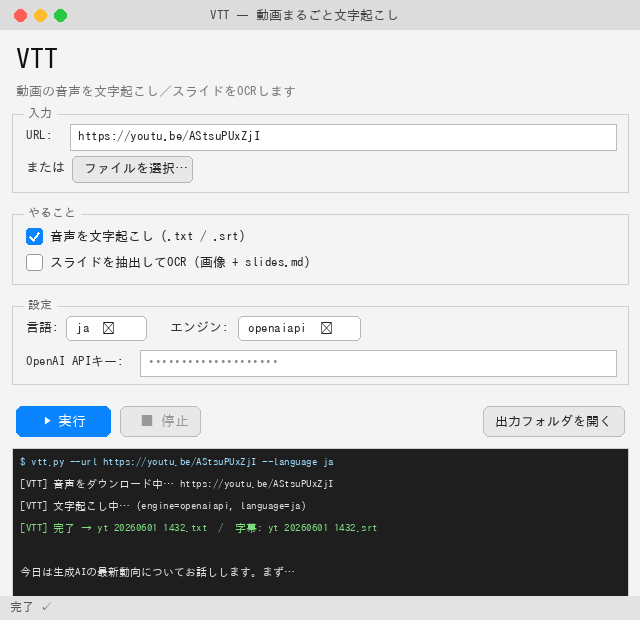

# VTT

ブラウザで再生できる動画やスピーチを全文文字起こし。

## いちばん簡単な使い方：GUIアプリ（CLI不要）

URL を貼ってボタンを押すだけ。Python標準の Tkinter のみで動く（追加インストール不要）。



```bash
python3 mac/gui.py
```

Finder からは `mac/vtt.command` をダブルクリックでも起動できる（初回は右クリック→「開く」）。
音声の文字起こし／スライドOCR のどちらか・両方をチェックで選び、「▶ 実行」を押すと
下のログに進捗が流れ、結果ファイルがフォルダに出力される。

> GUIは下の `vtt.py` / `slides.py` を裏で呼び出すだけのラッパー。CLIで細かく制御したい場合は
> 以下を直接使う。

## mac/ — Mac向け簡易ツール（録音 → 一括文字起こし）

同一Mac内で鳴っているシステム音声（ブラウザ/アプリの動画など）を
[BlackHole](https://github.com/ExistentialAudio/BlackHole) 経由で1ファイルに録音し、停止後に
[Buzz](https://github.com/chidiwilliams/buzz) の CLI を裏で1回呼び出してまとめて文字起こしする
`mac/vtt.py`。「聞きながら」ではなく「全部再生し終わったら文字が残っている」用途向け。

精度優先で OpenAI Whisper API（クラウド）を既定エンジンにしているが、完全ローカル
（faster-whisper / whisper.cpp）にも切り替え可能。

### できること / 制約

- ✅ ブラウザ・アプリ問わず、Macで鳴っている音をまとめて文字起こし
- ✅ 録音中は別の（**無音の**）作業をしてOK。自分の耳でも音を聞ける
- ✅ 録音せず既存の音声/動画ファイルを直接文字起こしも可（`--file`）
- ⚠️ システム音声の「ミックス全体」を拾うため、対象の動画以外の音（通知音・別の動画・
  音楽・通話）も一緒に文字起こしされる → **対象の音だけ鳴らし、通知はミュート推奨**
- ⚠️ 「動画を再生せずデータから直接読む」ことは汎用的には不可（DRM/ストリーム暗号化のため）。
  本ツールは再生中の音声出力を拾う方式

### 前提（インストール）

```bash
brew install ffmpeg
brew install --cask buzz        # または: pipx install buzz-captions
brew install blackhole-2ch
```

その後、初回のみ「Audio MIDI設定」で**複数出力装置**を作成し、内蔵スピーカー＋BlackHole を
まとめてシステム出力に設定する（詳細は `bash mac/setup.sh` が案内）。

### 使い方

```bash
# 環境確認（不足ツールや設定手順を表示）
bash mac/setup.sh

# 精度優先（クラウドAPI）。APIキーを環境変数で渡す
export OPENAI_API_KEY=sk-...
python3 mac/vtt.py              # 録音開始 → 対象を再生 → Ctrl+C で停止＆文字起こし

# 完全ローカル（オフライン・無料）で動かす場合
python3 mac/vtt.py --engine fasterwhisper --model-size medium

# URLから直接（YouTube/Voicy/NewsPicks等・録音もBlackHoleも不要・推奨）
python3 mac/vtt.py --url "https://youtu.be/AStsuPUxZjI"

# ログイン必須/有料コンテンツ（Voicyプレミアム・NewsPicks有料 等）はブラウザのcookieを使う
python3 mac/vtt.py --url "https://voicy.jp/..." --cookies-from-browser chrome

# 録音せず既存ファイルを文字起こし
python3 mac/vtt.py --file movie.mp4

# 主なオプション
#   --language ja|en|auto         言語（既定 ja、auto で自動判定）
#   --url URL                     URLから音声取得して文字起こし（要 yt-dlp）
#   --cookies-from-browser NAME   ログイン必須コンテンツ用 (chrome/safari/firefox)
#   --file PATH                   既存の音声/動画ファイルを文字起こし
```

### URLの扱い（自動判定）

`--url` は yt-dlp（1800以上のサイト対応）に渡すだけなので、**サイトごとの個別設定は不要**。

| サイト | 取得 | 備考 |
|---|---|---|
| YouTube | ✅ | そのまま取得 |
| Voicy | ✅ | 有料回は `--cookies-from-browser` でログイン情報を渡す |
| NewsPicks | ⚠️ | 取得できる場合あり。長尺が途中で切れる/有料でDRMの場合は録音モードへ |

取得できないサイト（DRM・未対応）は、**ブラウザで再生しながら録音モード**（引数なしの
`python3 mac/vtt.py`）で取り込めば、サイトを問わず文字起こしできる。

## mac/slides.py — 映像からスライドを抽出してOCR

動画の「画面が切り替わった瞬間」のフレームを自動抽出し、各スライド画像を
クラウドのビジョンAI（OpenAI GPT-4o）に渡して、書かれている文字・図表の要点を
テキスト化する。音声の文字起こし（`vtt.py`）と組み合わせると、聞かなくても／見なくても
内容が手元に残る。

```bash
export OPENAI_API_KEY=sk-...
python3 mac/slides.py --url "https://youtu.be/AStsuPUxZjI"   # URLから
python3 mac/slides.py --file talk.mp4                         # ローカル動画から

# 主なオプション
#   --scene-threshold 0.3         シーン変化の感度（小さいほど多く抽出）
#   --every 30                    シーン検出でなく30秒ごとに抽出
#   --model gpt-4o-mini           安価なモデルに変更
#   --cookies-from-browser chrome ログイン必須/有料コンテンツ用
```

出力は `slides_YYYYmmdd_HHMMSS/` に、スライド画像（`slide_*.jpg`）と書き起こし
（`slides.md`：各スライドのタイムスタンプ＋抽出テキスト）。

> 注: スライドが少ししか抽出されない時は `--scene-threshold 0.2` に下げる、逆に多すぎる
> 時は上げる。喋りっぱなしで画面変化が乏しい動画は `--every 30` で一定間隔抽出に。

`Ctrl+C` で録音を停止すると、その場でまとめて文字起こしし、入力と同じ名前の
`recording_*.txt`（本文）と `recording_*.srt`（字幕）を書き出す。
